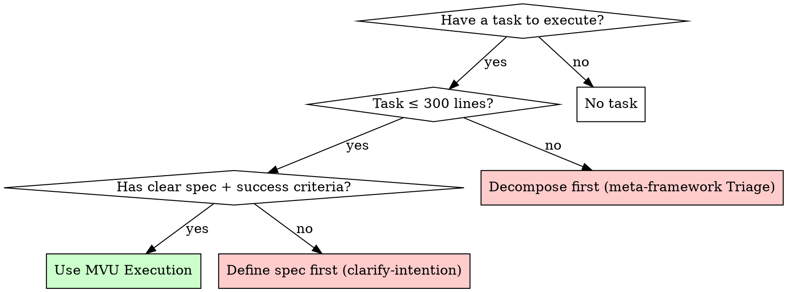
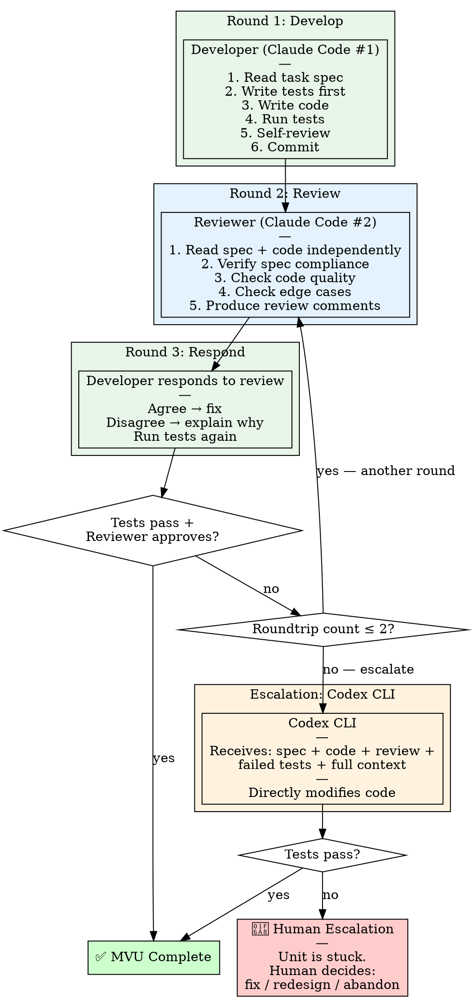

# MVU Execution — Minimum Viable Unit Protocol

The atomic unit of reliable software delivery. One unit in, verified deliverable out.

**Core principle:** Every MVU exits with tests passing and review approved, or it doesn't exit at all.

**Violating the letter of this rule is violating the spirit of this rule.**

## The Iron Law

```
NO MVU MARKED COMPLETE WITHOUT:
  1. Tests passing (fresh run, not "should pass")
  2. Review approved (not self-review alone)
  3. Max 2 roundtrips before escalation (no infinite loops)
```

## What Is an MVU

An MVU is the smallest unit of work that produces an independently verifiable deliverable.

| Property | Criteria |
|----------|----------|
| Size | 100-300 lines changed (if larger, decompose further) |
| Scope | Single responsibility — one thing done well |
| Testability | Can be independently tested (has clear inputs/outputs) |
| Contract | Has explicit spec: what it should do, what "done" means |
| Completion | 1-2 roundtrips to finish (if not, unit is too big) |

**If a task doesn't fit these criteria, it's not an MVU — decompose it first.**

## When to Use



**Standalone (Light task from Triage):** Entire task = 1 MVU. Use this skill directly.
**Within subagent-driven-development:** Each task in the plan is an MVU. This skill governs the per-task execution loop.

## The Protocol



### Step-by-step

**Step 1 — Dispatch Developer** (use `./developer-prompt.md`)
- Developer gets: full task spec, context, working directory
- Developer MUST: write tests first, implement, run tests, self-review, commit
- Developer CAN: ask questions before starting (answer them before proceeding)

**Step 2 — Dual-Stage Review**

Review is split into two stages. Stage 1 must pass before Stage 2 runs.

**Stage 1 — Spec Compliance Review**

Dispatch a reviewer subagent with the following prompt:

```
You are the Stage 1 reviewer. Your only job is spec compliance.
Do NOT review code quality, style, or patterns — that is Stage 2's job.

## Task Spec (what was requested)

[FULL TEXT of task spec / plan requirements]

## Success Criteria

[Explicit list of what "done" means — from spec or plan]

## Developer's Report

[Paste developer's implementation report here]

## CRITICAL: Do Not Trust the Report

The developer's report may be incomplete, inaccurate, or optimistic.
You MUST verify everything by reading actual code.

DO NOT: take developer's word, trust claims about completeness, accept their
interpretation of requirements, skip reading code because the report sounds thorough.

DO: read every changed file, compare implementation to requirements line by line,
check for missing pieces, look for unplanned additions.

## Your Checklist

A. Missing Requirements
   For EACH requirement in the spec/plan:
   - Is it implemented? (read the code, do not trust the report)
   - Is it implemented correctly per the spec's intent?
   - Are there sub-requirements or edge cases specified that were skipped?

B. Unplanned Additions
   For EACH file changed or created:
   - Was this file change required by the spec?
   - Does it contain functionality not requested?
   Over-building is a spec violation. If the spec says "add X", adding X+Y is wrong.

C. Misinterpretations
   - Did the developer interpret any requirement differently than intended?
   - Did they solve the right problem but in the wrong way?

D. Test Coverage of Spec
   - Do the tests verify the spec requirements (not just implementation details)?
   - Is each requirement covered by at least one test?

## Output Format

{
  "spec_review": {
    "verdict": "pass|fail",
    "issues": [
      {
        "type": "missing|extra|misinterpretation|undertested",
        "severity": "critical|high|important|minor",
        "description": "...",
        "spec_reference": "...",
        "file": "...",
        "line": null
      }
    ],
    "summary": "..."
  }
}

verdict: "pass" — every spec requirement implemented and verified. Issues list empty.
verdict: "fail" — one or more requirements missing, extra, or misinterpreted. Issues non-empty.
There is no "partial pass". Spec compliance is binary.
```

- If `spec_review.verdict == "fail"` → skip Stage 2, send issues back to developer
- If `spec_review.verdict == "pass"` → proceed to Stage 2

**Stage 2 — Code Quality Review** (use `./reviewer-prompt.md` or dispatch `superpowers:code-reviewer`)
- Only runs after Stage 1 passes
- Reviewer checks: code style, patterns, edge cases, security, maintainability
- Reviewer produces: `quality_review.verdict` = `pass` or `fail` with issues list

**Combined output format:**
```json
{
  "spec_review": {"verdict": "pass|fail", "issues": []},
  "quality_review": {"verdict": "pass|fail", "issues": []},
  "overall_verdict": "approved|with_fixes|rejected"
}
```

Guard rules enforced by `core/helpers/guard.py`:
- `spec_review.verdict == "fail"` AND `overall_verdict == "approved"` → BLOCKED (contradiction)
- Stage 2 ran when Stage 1 failed → BLOCKED (fix spec first)
- `quality_review.verdict == "fail"` AND `overall_verdict == "approved"` → BLOCKED (contradiction)
- Only `overall_verdict == "approved"` passes the guard

Backward compatibility: The legacy single-field format (`{"verdict": "approved"}`) is still accepted. The guard auto-detects the format.

**Step 3 — Developer responds to review**
- If review approved → MVU Complete ✅
- If spec issues found → Developer fixes spec compliance first, then re-submit for Stage 1
- If quality issues found → Developer fixes quality issues, re-submit for Stage 2 only
- Developer CAN disagree with review feedback (with technical reasoning)

**Step 4 — Count roundtrips**
- Roundtrip = one develop → review → fix cycle
- If roundtrip ≤ 2 → send back to Reviewer for re-review
- If roundtrip > 2 → escalate to Codex CLI

**Step 5 — Codex CLI Escalation** (use `./escalation-prompt.md`)
- Codex receives: spec + all code + review history + failed test output
- Codex directly modifies code to resolve issues
- Run tests after Codex changes

**Step 6 — Human Escalation**
- If Codex CLI doesn't resolve → human decides: fix manually, redesign the unit, or abandon
- This should be rare. If it happens frequently, the units are too complex — decompose further.

## Reliability Guarantee

| Stage | Cumulative Reliability |
|-------|----------------------|
| Developer self-test | ~90% |
| + Reviewer catch | 1-(1-0.9)² = ~99% |
| + Codex CLI fallback | ~99.9% |
| + Human escalation | ~100% |

**The goal: every MVU deliverable is something you can rely on 100%.**

## Prompt Templates

- `./developer-prompt.md` — Dispatch developer subagent
- Stage 1 spec compliance reviewer — inline above (Step 2, Stage 1)
- `./reviewer-prompt.md` — Dispatch Stage 2 reviewer (code quality) or combined review for simple MVUs
- `./escalation-prompt.md` — Dispatch Codex CLI for stuck units

## Red Flags — STOP

- Marking MVU complete without fresh test run
- Skipping review ("it's only 50 lines")
- Developer and reviewer are the same agent instance (must be separate)
- Roundtrip count > 2 without escalating
- Escalating to Codex without providing full context (spec + code + review + tests)
- Unit > 300 lines (decompose first, don't stretch)
- No spec / success criteria defined (define first, don't wing it)
- Accepting "close enough" on spec compliance
- Infinite review loops (that's what the 2-roundtrip cap prevents)

**ALL of these mean: STOP and fix the process, not the code.**

## Rationalization Prevention

| Excuse | Reality |
|--------|---------|
| "It's trivial, skip review" | Trivial bugs still ship. Review anyway. |
| "Tests pass so review is redundant" | Tests verify behavior, review verifies design. Both needed. |
| "Just one more roundtrip" | Cap is 2. Escalate. Fresh eyes solve what loops can't. |
| "Codex is overkill for this" | If 2 rounds didn't fix it, your approach has a blind spot. Escalate. |
| "The unit is 400 lines but it's cohesive" | Split it. Cohesion is not an excuse for oversizing. |
| "I'll review my own code" | Self-review is Step 1. External review is Step 2. Both required. |

## Integration

**This skill is the atomic building block. Other skills compose it:**

- **superpowers:subagent-driven-development** — uses MVU Execution for each task in a plan
- **superpowers:executing-plans** — uses MVU Execution for each batch item
- **Standalone** — for Light tasks from meta-framework Triage (entire task = 1 MVU)

**This skill requires:**

- **superpowers:test-driven-development** — Developer must follow TDD within the MVU
- **superpowers:verification-before-completion** — evidence before any completion claim
- **superpowers:requesting-code-review** — review template for Reviewer dispatch

**Escalation requires:**

- Codex CLI installed and accessible (`codex` command available)
- If Codex not available, Human Escalation is the fallback for roundtrip > 2
